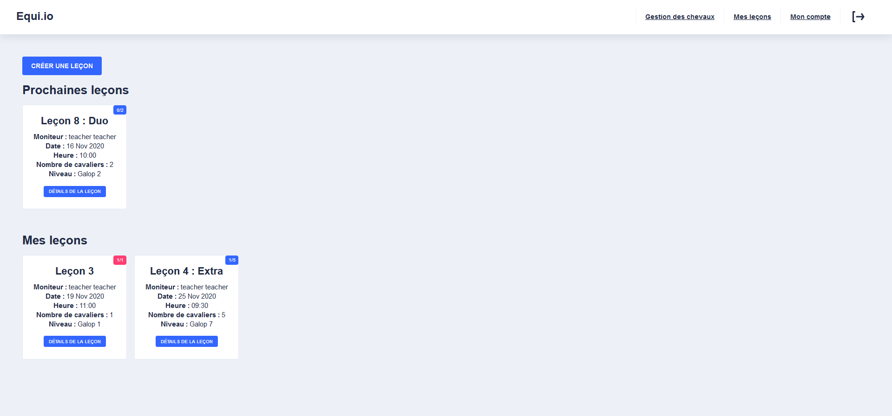
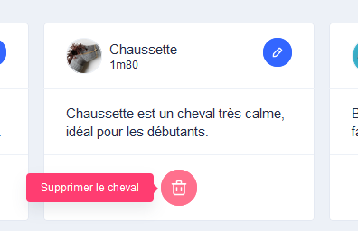

# ESIEA-Equiweb
> A website for a horse riding club 🎠

## Introduction
This application was made as part of our school work at ESIEA.
We had to work in pairs, and our team is composed of  and .

The purpose was to create a website with Angular and see what the creation of a website implies. 
We chose to make this application in Angular with a Node.js backend. 

## Instructions
- User : 
  - can register to become a horse rider
- Horse rider : 
  - edit his personal information (name, surname, e-mail address, telephone number) so that he can be contacted if necessary
  - register in available resumptions by filtering them by level
  - consult the resumptions where I am registered to know which horse I am going to ride
- Instructors : 
  - create a resumption schedule by choosing the times and levels of the riders (levels = from 1 to 7, or Gallop)
  - connect to the site to create resumptions ( lessons ) to associate horses to my riders
- Administrator :
  - search for a horse rider and see his personal information to be able to contact him
  - create accounts for the instructors with their personal information (last name, first name, e-mail address, telephone number) so they can log on to the site
  - manage the list of the club's horses (name) so that the instructors can associate them with the riders

## Demonstration
### General
- Homepage


- Registration


- Connexion


- Forget Password


- User Account


### User
- Lessons


- Subscribe to lessons


### Teacher
- Lessons



- Create lessons


- Lesson details


### Admin
- User manager


- Create user


- Horses manager


- Create horse


- Modify horse


- Delete horse




## Tools
- [Angular](https://angular.io/)
- [Node.js](https://nodejs.org/)
- [Angular Material](https://material.angular.io/) 
- [MongoDB](https://cloud.mongodb.com/)

## Installation
```
# clone project
git clone https://github.com/Nashunn/ESIEA-Equi.io.git

# install Back dependencies and start it 
cd BACK-Equiio\
npm install
nodemon server.js

# install Front dependencies and start it
cd FRONT-Equiio\
npm install
npm start
